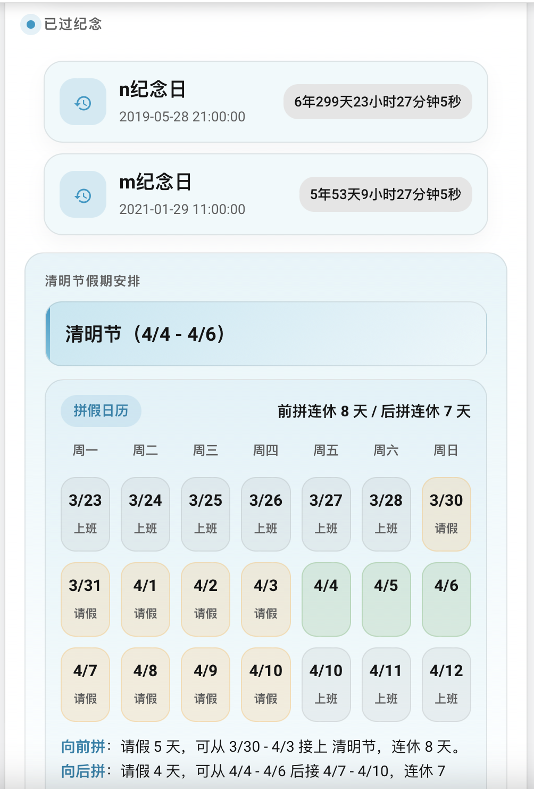

# Chinese Holiday 中国节假日日历

一个面向 Home Assistant 的中国节假日与纪念日传感器，支持节假日、节气、阳历/农历纪念日、生日年龄、周年计时和通知脚本，并可配合前端卡片展示。


## 快速接入

### 1. 安装集成

推荐使用 HACS：

1. 在 HACS 中添加自定义仓库：`https://github.com/Crazysiri/chineseholiday`
2. 搜索并安装 `中国节假日日历`
3. 重启 Home Assistant

也可以手动安装：

1. 将 `custom_components/chineseholiday` 目录复制到 HA 配置目录下的 `custom_components/`
2. 重启 Home Assistant

### 2. 在 HA 中添加并配置

`v0.3.x` 起支持集成配置流，推荐直接在 UI 中完成配置：

1. 打开 `设置 > 设备与服务 > 添加集成`
2. 搜索 `中国节假日日历`
3. 按 3 步填写：
   - 基本设置：名称、通知脚本、通知时间、是否暴露详细属性
   - 纪念日设置：公历纪念日、农历纪念日、精确计时纪念日
   - 通知规则：通知规则

默认会创建实体 `sensor.chinese_holiday`。如果你是旧版 YAML 用户，实体名仍取决于 `name`。

UI 中显示的是中文字段名，底层仍然对应原来的 YAML 键：

| UI 中的名称 | 对应旧 YAML 键 |
| --- | --- |
| 公历纪念日 | `solar_anniversary` |
| 农历纪念日 | `lunar_anniversary` |
| 精确计时纪念日 | `calculate_age` |
| 通知规则 | `notify_principles` |

也就是说，UI 里看不到 `solar_anniversary`、`lunar_anniversary`、`calculate_age`、`notify_principles` 这些英文键名，但它们仍然是这几个字段实际对应的数据结构。

### 3. 接入前端卡片

配合前端卡片使用效果最好：<https://github.com/Crazysiri/chineseholiday_card>

新版推荐流程是先完成后端集成，再把卡片绑定到实体：

1. 安装 `chineseholiday_card`
2. 在 Lovelace 资源中添加：

```yaml
resources:
  - type: module
    url: /local/custom-lovelace/ch_calendar-card/ch_calendar-card.js
```

3. 添加卡片：

```yaml
type: custom:ch_calendar-card
entity: sensor.chinese_holiday
icons: /local/custom-lovelace/ch_calendar-card/icons/
```

如果你沿用旧版 YAML 配置，例如 `name: holiday`，这里的实体改成你的实际实体 ID，比如 `sensor.holiday`。



## 支持的能力

- 中国节假日、工作日、休息日状态
- 最近节日与放假安排
- 节气、农历、公历、星期、本年度周数
- 阳历/农历纪念日
- 生日自动显示年龄，纪念日自动显示周年
- `calculate_age` 精确显示已经过去/还有多久
- `notify_principles` + `notify_script_name` 节日提醒
- UI 配置流，同时保留 YAML 向后兼容

## 配置示例

### UI 字段与旧键名对照

| UI 中的名称 | 旧 YAML 键 | 说明 |
| --- | --- | --- |
| 公历纪念日 | `solar_anniversary` | `MMDD` 或 `YYYYMMDD` -> 名称列表 |
| 农历纪念日 | `lunar_anniversary` | `MMDD` 或 `YYYYMMDD` -> 名称列表 |
| 精确计时纪念日 | `calculate_age` | 列表，每项包含 `date` 和 `name` |
| 通知规则 | `notify_principles` | 键是提前天数，值是日期/节日列表 |

### UI 配置里的对象格式

UI 中的“公历纪念日”对应 `solar_anniversary`：

```yaml
0101:
  - 元旦聚餐
20200220:
  - bb生日
  - aa和bb结婚纪念日
```

说明：

- 文案包含“生日”时，会显示成 `xx生日(1岁)`
- 其它文案统一显示为 `xx纪念日(1周年)`

UI 中的“农历纪念日”对应 `lunar_anniversary`：

```yaml
0321:
  - 妈妈农历生日
```

UI 中的“精确计时纪念日”对应 `calculate_age`：

```yaml
- date: "2022-10-10 10:23:10"
  name: aa和bb结婚周年
```

UI 中的“通知规则”对应 `notify_principles`：

```yaml
'14|7|1':
  - date: "0101"
    solar: true
  - date: "0102"
    solar: false
'0':
  - name: "母亲节"
  - name: "父亲节"
```

### 旧版 YAML 配置

仍然支持 `configuration.yaml`：

```yaml
sensor:
  - platform: chineseholiday
    name: holiday
    solar_anniversary:
      "0121":
        - aa生日
        - cc生日
      "20200220":
        - bb生日
        - aa和bb结婚纪念日
    lunar_anniversary:
      "0321":
        - aa农历生日
    calculate_age:
      - date: "2022-10-10 10:23:10"
        name: "aa和bb结婚周年"
    notify_script_name: "test"
    notify_times:
      - "09:10:00"
      - "13:00:00"
    notify_principles:
      "14|7|1":
        - date: "0101"
          solar: false
        - date: "0102"
      "0":
        - name: "母亲节"
        - name: "父亲节"
```

## 通知脚本示例

```yaml
test:
  sequence:
    - service: notify.mobile_app_xxx
      data:
        title: "节假日提醒"
        message: "{{ message }}"
```

回调里的 `message` 会是已经拼好的提醒文案，例如“距离 xx 生日还有 7 天”。

## 版本说明

- `0.3.1-pre`：增加 UI 配置流，补充品牌资源、多语言文案，适配新版 Home Assistant / HACS 分发
- `0.2.0`：支持 HACS，前端从 Polymer 升级到 Lit

更早的更新记录、历史说明和旧接入方式见：[旧版文档](docs/legacy.md)
