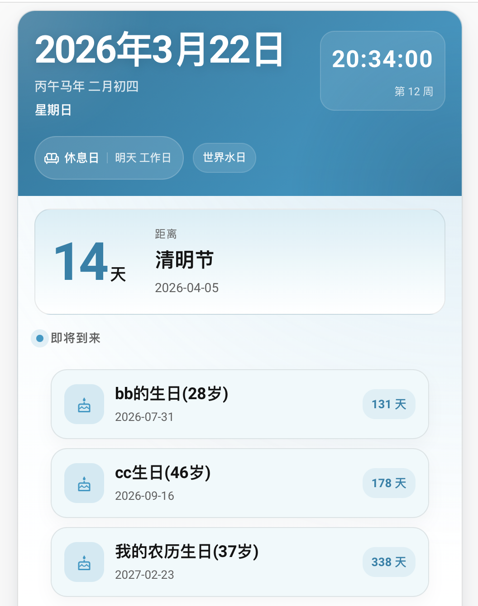

# 旧版文档

以下内容为历史 README 整理归档，保留旧版本的更新记录、说明和接入方式，便于老用户迁移。

## 历史更新

### 2026.03.22

版本 `0.3.1-pre`

1. 新增集成配置流程，支持在 UI 中直接添加和配置集成
2. 补充品牌资源、多语言文案与初始化结构，适配新版 Home Assistant / HACS 分发

### 2023.07.12

版本 `0.2.0`

1. 支持 HACS
2. Polymer 升级为 Lit

### 2020.06.03

1. 修复当天纪念日不显示的问题
2. 修复 custom UI 间距问题
3. 点击 custom UI 可以进入控件详情
4. 增加控件详情汉化
5. 在最近纪念日之后增加“接下来的纪念日”

### 2020.03.30

可以配置生日显示为 `xx生日(10岁)`：

```yaml
solar_anniversary:
  "20200121":
    - aa生日
    - xx纪念日
```

说明：

- 文案包含“生日”时，会显示成 `xx生日(1岁)`
- 其它文案统一显示为 `xx纪念日(1周年)`

其它优化：根据社区代码，将休息日、节假日、工作日改成 icon。

### 2020.02.19

加入 custom UI：

```yaml
resources:
  - type: module
    url: /local/custom-lovelace/ch_calendar-card/ch_calendar-card.js

- type: custom:ch_calendar-card
  entity: sensor.holiday
  icons: /local/custom-lovelace/ch_calendar-card/icons/
```

### 2020.02.08

版本 `0.1.3`

1. 新增外部调用脚本功能，支持母亲节和父亲节设置
2. 修复由于 UTC 时间导致过一天不更新时间的 bug

### 2020.02.06

版本 `0.1.2`

1. 节气改为算法计算，不再依赖写死数据

### 2020.02.04

版本 `0.1.1`

新增调用外部脚本机制，可实现类似“国庆节还有 14 天时通知”的能力。

```yaml
notify_script_name: "test"
notify_times:
  - "09:10:00"
  - "13:00:00"
notify_principles:
  "14|7|1":
    - date: "1001"
      solar: false
    - date: "1002"
```

ios 通知脚本示例：

```yaml
test:
  sequence:
    - service: notify.mobile_app_xxx
      data_template:
        title: "节假日提醒"
        message: "{{ message }}"
```



## 早期说明

### 参考

1. <https://bbs.hassbian.com/thread-9133-1-1.html>
2. <https://bbs.hassbian.com/forum.php?mod=viewthread&tid=1237&highlight=%E5%86%9C%E5%8E%86>

个人感觉有些地方不太适合自己的场景，所以重构了部分代码，增加了一些功能，也去掉了一些功能。

### 感谢

1. WalterDSU 提供 README 优化建议：<https://github.com/WalterDSU>

### 去掉的功能

1. 最近的纪念日

理由：

- 年份固定，每年都要调整
- 没有找到合适的使用场景

### 增加的功能

1. 每年的纪念日，包括阳历和阴历

理由：

- 更适合生日等每年重复的日期
